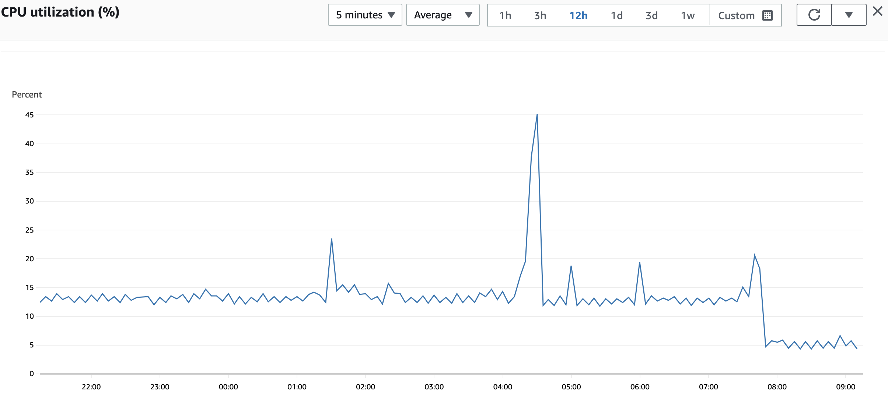

# cpr
cpr monitors the health of your docker containers and restarts them when necessary. 

## Motivation

Why was `cpr` created, when there are plenty of other alternatives on the market, such as [docker-autoheal](https://github.com/willfarrell/docker-autoheal)? 
Well, unfortunately the alternatives all require forking a process for each healthcheck. This is quite costly,
especially on smaller cloud instances. 

For example, here we see the difference in CPU utilization between `docker-autoheal` and `cpr` on 
an AWS EC2 `t3a.small` instance:



We can see the CPU usage drop from ~13% to ~5% after having switched to `cpr` just before 08:00. 

For reference, this was a `t3a.small` instance with healthchecks enabled for 3 containers, each of which had
a default interval of 2 seconds. The instance was essentially idling, with no traffic from outside. (The spikes
we see early in the morning are cronjobs running.)

## Example usage

Running `cpr` using docker-compose: 

```
version: '3.0'
services:
  cpr:
    container_name: cpr
    image: kopf/cpr:latest
    restart: "unless-stopped"
    volumes:
      - /var/run/docker.sock:/var/run/docker.sock
```

Once `cpr` is running, you need to mark containers with labels in order to let it know what healthchecks to perform. For example:

```
version: '3.0'
services:
  nginx:
    image: nginx
    container_name: nginx
    volumes:
      ...
    ports:
      ...
    labels:
      cpr.enabled: "true" # required
      cpr.url: "http://nginx/_nginxhealthcheck/" # required; url to be probed
      cpr.headers: '{"Host":"www.mywebsite.com","X-Forwarded-Proto":"https"}' # optional; additional headers to send in healthcheck
      cpr.start_period: 10 # optional; number of seconds to wait before checking
      cpr.retries: 3 # optional; number of retries to make
      cpr.timeout: 2.5 # optional; number of seconds before timing out
```

## Configuring cpr defaults

`cpr`'s defaults can be configured by setting environment variables on the `cpr` container itself. Here is an overview:

* `CPR_DEFAULT_START_PERIOD` (default: `8`) - The length of time (in seconds) to wait before probing a container.
* `CPR_DEFAULT_INTERVAL` (default: `3`) - The length of time (in seconds) to wait between probes.
* `CPR_DEFAULT_RETRIES` (default: `2`) - The number of retries before marking a container as unhealthy and restarting it.
* `CPR_DEFAULT_TIMEOUT` (default: `1`) - The default HTTP timeout (in seconds) to use when probing a container.
* `CPR_REFRESH_TIME` (default: `60`) - The default amount of time (in seconds) to wait before scanning for new `cpr`-enabled containers to probe.  
* `CPR_LOGLEVEL` (default: `INFO`) - The default log level. Set to `DEBUG` for more verbose logging. 

## Known limitations

* `cpr` won't detect changes to your containers' logs after they've been scanned. In order to ensure cpr respects changes after the fact, be sure to restart `cpr` once you've redeployed your services with new labels. 